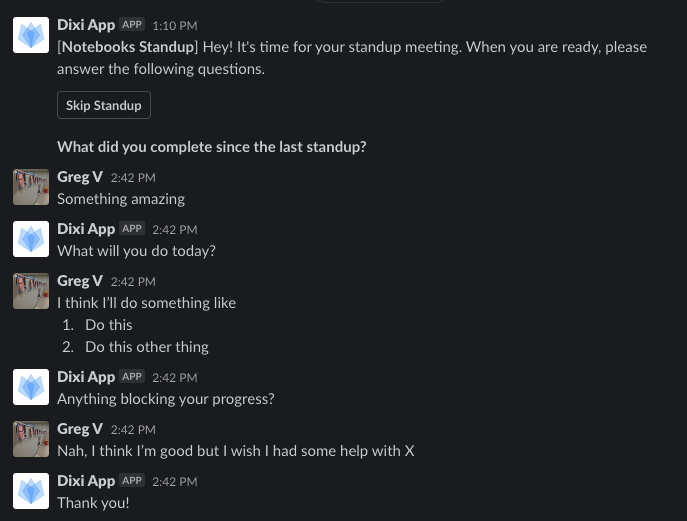

👉 [Check out this YouTube video for a walkthrough](https://youtu.be/GHVl0YPveoQ)

👉 [Original LinkedIn post](https://www.linkedin.com/posts/gregvannoni_summer-2020-internship-survey-activity-6658239700710633472-EU_T)

👉 [This is the end-goal](https://padlet.com/gregvannoni/c9gopoit4i1aku59): tie everything together in opportunityhack.io

# Read this first
If you decide to help support non-profits by working on Opportunity Hack this summer, you need to be made aware of a few things.

0. Opportunity Hack is run by volunteers who have full-time jobs.  We'll be making time to help you this summer.
1. This is the first time we're doing this.
2. We're doing this to provide experience and education over the summer for students who may have had difficulty in finding internships, either because they couldn't find one or because it was [cancelled](https://github.com/gcreddy42/hiring2020).
3. There is no guarantee that you'll receive a job from the work you do with this internship.
4. All of the work you do will be publicly available (i.e. Slack, GitHub, demos will be recorded and published on YouTube) for any employer and for you to put in your portfolio.  Ideally the effort you put in is equal to your chances for success in the future.
5. We cannot offer official letters of employment (if you are on a visa) as we are a group of people who volunteer our technology-focused minds to help non-profits.  You'd be joining us in our guild.  Hopefully by the same time next year we'll have an official non-profit and we can help with letters of employment.  This is not an unpaid internship, this is you volunteering your time over the summer.

# Table of contents
1. [Outcomes](#outcomes)
2. [Projects](#projects)
3. [Schedule](#schedule)
   1. [Full schedule](#full-schedule)
   1. [Getting started](#getting-started)
   1. [Standups](#standups)
   1. [Demo meetings](#demo-meetings)
   1. [Mentor "office hours"](#mentor-office-hours)

# Outcomes
## Your benefit
By working on an Opportunity Hack project over the summer, you'll not only be helping your community, but you'll learn these skills:
1. Learn GitHub
2. Agile - sprints, demos, planning
3. Write code
4. Work with a team

Some other things:
1. Public proof of your work for your portfolio
2. A document that describes the work you put in this summer
3. A recommendation for above-and-beyond effort

## Our benefit
1. We'd love to prove that a virtual summer project can work
2. Continued work on meaningful projects we have identified for non-profits
3. Making connections with you

# Projects
These projects come from our years of experience working with non-profits, we sought to generalize the problems we see in order to impact many non-profits, so although you'll see a few called out, we intend for these solutions to be used at scale, globally, at a relatively inexpensive price point.

## 1. Digitize Paper Forms
Slack Channel: `#2020-vol-intern-digitize-paper-forms`

Non-profits are using paper forms.  The cost to digitize these forms to an HTML form in order to integrate it into their existing systems is difficult.  Google Forms is great, yes, but it still requires some effort and knowledge without allowing integration with existing software applications.  We have been working with ASU on two senior capstones around this problem that we can leverage as a head start.

### Requirements
1. You'll be given an [YOLOv3](https://pjreddie.com/darknet/yolo/) ML model (from our work with ASU)
2. You'll be given two images of paper forms
3. Given the bounding boxes output from the ML model, the solution shall create an HTML-based form for each image
4. The solution shall handle additional images in the future
5. The solution shall store the data submitted in the form
6. The solution shall be deployable via 1-button click with a service like [Heroku](https://www.heroku.com/)
### References
- 2018 Proposal for ASU Tempe [Digitize Paper Forms with Machine Learning Part 1](https://docs.google.com/document/d/1xZSuvGs2s-AP4staL0lyeUUDJCBc_DggPglEpLoMZI8/edit?usp=sharing)
- 2019 Proposal for ASU Tempe [Digitize Paper Forms with Machine Learning Part 2](https://docs.google.com/document/d/1nXNlYUaABAfAKbmi1ZnU79VgFa7B5NLPTkdw4dxIRVU/edit?usp=sharing)
- [Mi Benefial Legal](https://github.com/opportunity-hack/Arizona/issues/46) problem statement history from Opportunity Hack
- [National Kidney Foundation](https://github.com/opportunity-hack/Arizona/issues/24) problem statement history from Opportunity Hack
- This [DevPost submission](https://devpost.com/software/a-2d-2-all-about-dat-data) from 2018 Opportunity Hack
- [2019-2020 ASU Capstone Github Repo](https://github.com/MrPanda1/YOLO-FormDataset)
- [2018-2019 ASU Capstone GitHub Repo](https://github.com/opportunity-hack/digitize-paper-forms)

## 2. Simple Electronic Healthcare Records (EHR)
Slack Channel: `#2020-vol-intern-simple-ehr`

Some non-profits have "clients" that require demographics and treatment to be tracked easily.  This usually requires some scheduling component as well as a historical record of visits with services provided, then reports follow.  There are open-source EHR solutions on the internet, but none are simple enough for non-profits to use without dedicated training.
### Requirements
1. The solution shall allow for clients to register for the system, using Google Single Sign-on or system-based account creation
2. The solution shall record "treatments": medicine provided, music session, painting
3. The solution shall allow for role-based access: 
4. The solution shall log an audit record of activity
5. The solution shall be secure: (1) no security violations for packages, (2) strong authentication
6. The solution shall use an existing framework (e.g. [Django](https://hackernoon.com/configure-role-based-access-control-in-django-74fa94a54aff)) that offers authentication and role-based access.
7. The solution shall allow for data to be import via CSV including patient records and schedule
8. The solution shall be deployable via 1-button click with a service like [Heroku](https://www.heroku.com/)
### References
- [Chandler CARE Center](https://github.com/opportunity-hack/Arizona/issues/44) problem statement history from Opportunity Hack
- [Neurologic Music Therapy Services of Arizona (NMTSA)](https://github.com/opportunity-hack/Arizona/issues/31) problem statement history from Opportunity Hack
- [Sunshine Acres](https://github.com/opportunity-hack/Arizona/issues/23) problem statement from Opportunity Hack 2017
- Both [Will2Walk](https://github.com/opportunity-hack/Arizona/issues/38) and [ICM Food and Clothing Bank](https://github.com/opportunity-hack/Arizona/issues/37) submitted a shared "progress tracking" problem statement at Opportunity Hack 2018
- [2nd Place Opportunity Hack 2019 project](https://devpost.com/software/chandler-care-center-data-intake) for Chandler CARE Center
- [Opportunity Hack 2017 project for NMTSA](https://devpost.com/software/team-3-nmtsa)
- [Opportunity Hack 2019 project for NMTSA](https://devpost.com/software/nmtsa-scheduleapp)

## 3. Client Relationship Manager (CRM)
_Still working on these details_

This is the sister to the Lightweight EHR project above.  Instead of tracking health and progress of clients, non-profits typically do this with Excel or Google Forms and also manually integrate into DonorPerfect and other non-profit platforms.  SalesForce is the obvious leading solution here, [but still charges non-profits for use](https://www.salesforce.org/nonprofit_product/nonprofit-editions-pricing/).  Platforms like [SpiceCRM](https://www.spicecrm.io/) and [various open-source platforms](https://blog.capterra.com/free-and-open-source-crm/) are available, but non-profits don't have IT support right next to them, they need something simple and cost-effective.

## 4. Risk Scoring
Slack Channel: `#2020-vol-intern-risk-scoring`

Non-profits need a way to vet the standing of people, specifically for pets, as they want to be sure they are going to a nice home.  Given a social media profile (and potentially their network) that someone has granted access to, analyze the content of their posts to create a risk score to understand if there are any red flags for pet adoption.
### Requirements
1. The solution shall collect posts and bio information from Facebook or Twitter
2. The solution shall provide a high risk score for accounts that use terms that indicate violence, hate, animal cruelty, and malice -  this likely means that you will be looking for accounts that already exhibit this, or you can create mock accounts to validate and test the scoring methodology
3. The solution shall be deployable via 1-button click with a service like [Heroku](https://www.heroku.com/)
4. The solution shall provide a URL that a non-profit can send to a potential animal adopter.  This potential animal adopter will use this URL to sign into either Facebook and Twitter to allow this application to collect data as stated above in order to collect data that may not be publically available per privacy settings the user has provided
5. The solution shall not store data from the person's Facebook or Twitter account that is not private
6. The solution shall store the risk score along with the URL that was provided to the potential animal adopter
### References
- [Saving One Life Animal Rescue and Sanctuary](https://github.com/opportunity-hack/Arizona/issues/43) problem statement history from Opportunity Hack
- [My First Machine Learning Project: Designing a Hate Speech Detecting Algorithm](https://towardsdatascience.com/my-first-machine-learning-project-designing-a-hate-speech-detecting-algorithm-56ab32f10833)
- [Hate Speech Detection Using Natural
Language Processing Techniques](https://science.vu.nl/en/Images/werkstuk-biere_tcm296-893877.pdf)

## 5. Volunteer registration and tracking
There are a ton of non-profits that want to allow volunteers to register on their website, 
_Still working on these details_

Slack Channel: `#2020-vol-intern-volunteer-registration-and-tracking`

Perform market research to recommend a system for all non-profts to use.
### Requirements
1. Be able to list times available for volunteers along with location and duration of request
2. Be able to specify skill that is needed (e.g. painting, drywall, electrical, math tutor, etc.)
3. Increase communication between NPO and volunteers to increase engagement
4. Be able to find volunteer opportunities in a region
5. Be able to find opportunities that are good for families
6. Recommend volunteer opportunities based on previous experience
## References
- SignupGenius 

## 6. Intelligent Donation Platform
_Still working on these details_

Increase recurring donations or volume of donations
### Requirements
1. Recommend other items to donate: if someone donates a TV, ask if they also have shoes to donate
2. Cluster similar donors together to determine alternative marketing methods that may be more effective within the cohort

## 7. Inventory management system
A large set of non-profits that would benefit from a solution here are food pantries (note the difference between [a food bank and a food pantry](https://www.feedingamerica.org/hunger-blog/what-difference-between-food-bank-and-food-pantry)).  There are large food pantries who likely have all of the software they need (including an integration with [Link2Feed](https://www.link2feed.com/)), but most of the smaller food pantries won't have everything they need, but still need to provide food for their client base.  An effective, free, solution here will benefit many food pantries.

### Requirements
_Still working on these details_

### References
- [Matthew's Crossing Food Bank](https://github.com/opportunity-hack/Arizona/issues/9) received many Opportunity Hack solutions over the years to the point where they likely don't have any more problems to solve.  Unfortunately, these custom solutions cannot be generally applied to other food pantries.
- [Child Crisis AZ](https://github.com/opportunity-hack/Arizona/issues/15) problem statement form 2016 Opportunity Hack using QR codes to track inventory
- [Joshua Tree](https://github.com/opportunity-hack/Arizona/issues/28) also hoped to use barcodes to track inventory from 2017 Opportunity Hack

## 8. Notification system
_Still working on these details_

## 9. Data Analysis
_Still working on these details_

Slack Channel: `#2020-vol-intern-data-analysis`

### 9.1 Analyze trends to recommend areas of focus
- https://github.com/opportunity-hack/Arizona/issues/36

### 9.2 Allow non-profits to print forms, collect responses, scan them and easily analyze the data
- Productionalize [Survey Stack](https://devpost.com/software/survey-stack) from Opportunity Hack 2018 for [Animals and Humans in Disaster Inc.](https://github.com/opportunity-hack/Arizona/issues/35), [RealTimeSTEAM](https://github.com/opportunity-hack/Arizona/issues/36), and [NMTSA](https://github.com/opportunity-hack/Arizona/issues/31).

## 10. Recommend the best website platform for non-profits to use
This project only requires significant research in this space, you'lll need to create (free/trial) accounts, Google your heart out, and document your analysis of the various options available for non-profits to use.  Instead of surgically repairing various websites, we would instead like to recommend a platform that non-profits can use.  We'd then use Opportunity Hack to work with them to move their content to this platform that you recommend.
### Requirements
1. A proper solution shall cost less than $20/month
2. A solution shall allow for SEO to be configured and updated easily (ideally with no user input)
3. A solution shall allow for non-profits to easily link to their social media accounts
4. A solution shall allow for their social media accounts to easily link to specific posts on their website (e.g. you press "share" on the website and are able to make a Facebook/Twitter/LinkedIn post)
5. A solution shall allow non-profits to change content easily
6. A solution shall allow non-profits to easily configure donations
7. A solution shall allow for proper security (e.g. using Google SSO or Facebook SSO for ease of use and increased security instead of maintaining security within the website)
8. A solution shall provide significant documentation and various platforms and a cost/benefit analysis and comparison between products.  It may be useful to develop a scoring system in various categories so that you can clearly show the winner in this manner.
9. Uncached page load times shall be less than or equal to 3 seconds - [ref](https://www.criticalcase.com/blog/what-is-page-load-time-and-why-it-is-important.html)
### References
- [Cece's Hope Center](https://github.com/opportunity-hack/Arizona/issues/40), [Impact One Breast Cancer Foundation](https://github.com/opportunity-hack/Arizona/issues/41), and [Newtown CDC](https://github.com/opportunity-hack/Arizona/issues/42) all were looking for help in this area at the 2018 Opportunity Hack
- [Animals and Humans in Disaster Inc](https://github.com/opportunity-hack/Arizona/issues/35) also needs help in this space

## 11. Create the new OpportunityHack.io
We use [opportunity-hack.org](http://opportunity-hack.org/) to discuss our annual, global hackathons.  As we continue to create solutions that all non-profits can use, we want to build out the NPOaaS (Non-proft as a service) platform on opportunityhack.io.  This website will allow any non-profit to:
1. Find all relevant solutions we've created for them
2. Find recommendations for other solutions currently available along with our seal of approval recommending that they use them (because we've already tried them out)
One key thing that limits productivity of non-profits are separate systems that are not connected to one another.  While an existing solution may work for them initially, over time they will likely save cost and time by moving to an opportunityhack.io solution that combines many solutions into one platform.
### Requirements
0. [Be sure to read this padlet](https://padlet.com/gregvannoni/c9gopoit4i1aku59) that illustrates the end-goal of all of these projects: opportunityhack.io.
1. This solution shall use [Gatsby](https://www.gatsbyjs.org/) and [Netlify (free tier)](https://www.netlify.com/).  We normally don't lock solutions down to specifics, but in this case, we'd like this to be the technology for our solution.
2. This solution will give you autonomy and artistic license to create this website as you see fit.  Please check out our previous images [on Facebook](https://www.facebook.com/opportunityhack) and [opportunity-hack.org](http://opportunity-hack.org) to get a feel for what we already have as a good foundation for your creation.
3. This solution shall have its code stored in GitHub (just like all of the rest of the projects, but extremely important for us so that we can move what you've built over to opportunityhack.io).
4. opportunityhack.io shall have various sections as outlined in the above projects (for instance, "Digitize Paper Forms"). As background for you, these solutions will be provided as open-source, and also should be deployed with one-click using Heroku.  We will provide documentation, GitHub links, Heroku links, and a video walkthrough for each solution.  In the future, non-profits will be able to combine solutions together (e.g. CRM + notifications or Inventory Management + additional data analysis).
5. This solution may have mocked out Heroku and user screens that show how a non-profit would interact with this website.  Although we don't yet have this platform built, we would still love to have some help laying the foundation for what we think opportunityhack.io could be.
### References
- This [article on technologyadvice.com](https://technologyadvice.com/nonprofit/) discusses the various software platforms available to non-profits.  You can see the struggle that non-profits have with various CRM, donor management, email marketing, and accounting platforms.
- This [Medium article](https://medium.com/verticalchangehq/saas-for-nonprofit-3a5a70099824) also discusses the challenges that many non-profits face.

# Schedule
## Full Schedule
We're starting on May 8th and we're calling August 7th our end.

## Getting started
1. Join the Slack channel for the topic you want to work on
2. Based on the availability of everyone, you may already have people who want to work on this project, if you want to work with a team, say "hi" and join a team.  It may be awkward, but you'll be fine.
3. Once you have formed a team, [create a public Opportunity Hack Slack channel](https://www.google.com/search?q=creating+a+slack+channel&oq=creating+a+slack+channel) and invite your team, then an Issue ticket [here in this GitHub project](https://github.com/opportunity-hack/2020-summer-volunteer-internship/issues/new/choose).  Click on "Get started" and fill out the template - one per team.
4. This ticket is where all of your documentation for the summer will live. For demos, you can either upload a video or link to YouTube, all designs and general discussions will live here.
5. All of your code will go into https://github.com/2020-opportunityhack-voln-internship
   - You will need to Slack us in `#help-github` to ask for a project be created along with the GitHub username or email address we should assign as the owner to this repo.  
   - Once added, you'll receive an email *that you must accept* then you'll be able to add the rest of your team.
6. You should now start researching previous Opportunity Hack DevPost and GitHub submissions (and even Slack history), planning with your team how you'll attack your problem, and get off to the races!

## Agile meetings
### Standups
Every Monday and Wednesday (via Slack).  You'll be messaged by Dixi App every Monday and Wednesday to ask for status.  That status will then be shared in your team's Slack channel for everyone to see once everyone has provided their standup details.

Here's an example of what this will look like

### Demo meetings
Every 2 weeks on Friday - recorded and published to YouTube.  You'll get a reminder in Slack, and by the end of the day you should have a 4-minute or less video describing your contributions to the project for those 2 weeks.  Each person will create their own demo video.

### Planning meetings
Every 2 weeks on Wednesday.  You should meet with your teams via Google Meet, Zoom, Slack call, or Slack chat to take stock of where you are at now and what needs to be done.  In order to track this work, we'd recommend you use a [Trello board like this](https://trello.com/templates/engineering/agile-sprint-board-ZqN99gGN), but this is completely up to you and your team.

## Mentor "office hours"
- Every week to start for the first 2 weeks
- Switch to 2-week meetings after first 2 weeks
- We'll be using Google Meet and the link will be provided in our `#2020-vol-intern-general` Slack chat
